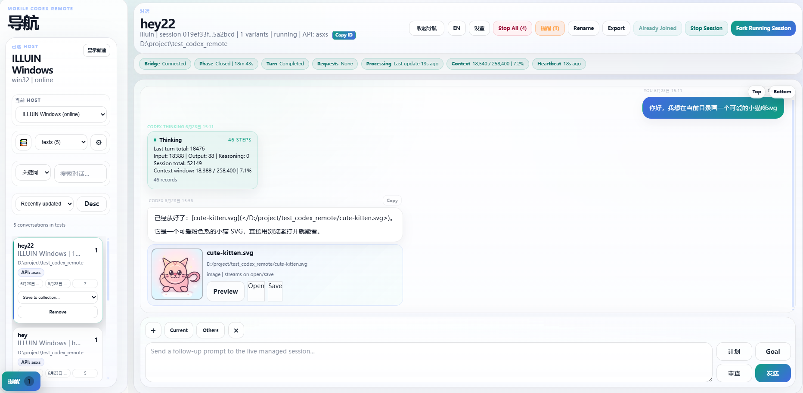
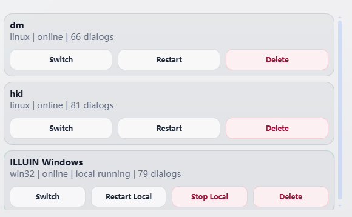
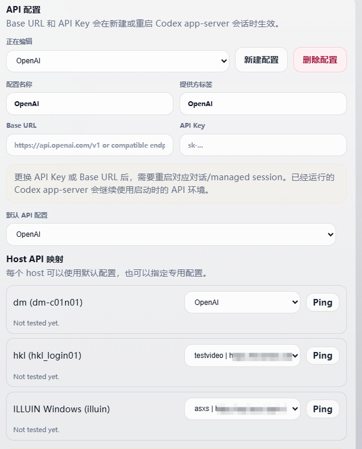
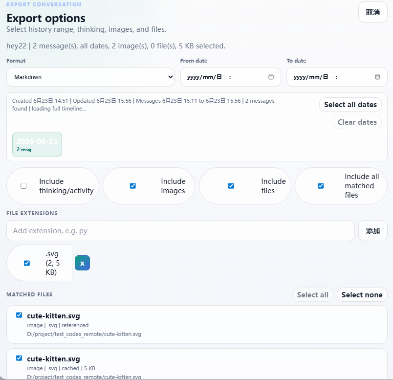
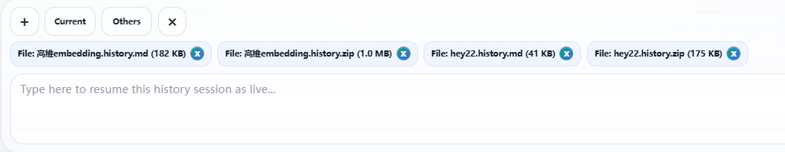

# Mobile Codex Remote

Chinese landing page: [README.md](README.md)
Detailed Chinese guide: [README.zh-CN.md](README.zh-CN.md)
Release/update report: [docs/update-report-2026-06-15.md](docs/update-report-2026-06-15.md)

Mobile Codex Remote is a browser control plane for Codex sessions running on local computers, remote Linux hosts, and HPC clusters. It gives you one web UI for starting, resuming, forking, steering, interrupting, reviewing, exporting, importing, and monitoring Codex work from a desktop browser or phone.

v2.01 notes archive: [README_v2.01.md](README_v2.01.md)

## Features

- Multi-host control for local PCs, remote Linux machines, and HPC login nodes.
- Session discovery from each host's Codex home, usually `~/.codex`.
- Managed Codex app-server sessions with new, resume, fork, stop, interrupt, steer, compact, plan, and review controls.
- Conversation search by keyword, path, title-like metadata, and message content.
- Conversation sorting by created time, recently updated time, or message count.
- Real-time Codex rollout JSONL tailing for imported history, runtime status, token usage, diagnostics, requests, and transcript updates.
- Composer attachments for local files, images, host image paths, prompt cards, skills, and imported conversation history.
- Conversation export to Markdown, JSON, or Zip bundle, with filters for date range, thinking/activity, images, files, extensions, and selected files.
- Conversation import from the current session or multiple other sessions, each with per-session thinking/images/files options.
- Browser-to-host file transfer, chunked large uploads, cached inline image/text handling, and remote file cards for generated outputs.
- Model and skill list controls with retry cooldowns to avoid repeated background timeout spam.
- Request-user-input UI for plan-mode/model prompts that ask the user to choose options or enter custom text.
- Per-host API profiles for OpenAI-compatible API keys and base URLs.
- Isolated managed Codex homes to reduce conflicts with an interactive local Codex CLI.
- Mobile-friendly navigator, transcript controls, image preview, status windows, alerts, and compact runtime chips.
- HPC connector profiles with SSH key, password, keyboard-interactive, OTP/MFA, gateway/jump host, tmux bootstrap, and detached fallback.

## Architecture

```text
phone/browser -> relay web/API server -> host-agent -> Codex app-server
                                      -> local files / HPC workspace
```

- `apps/relay` serves the web UI, stores lightweight state, relays commands/events, caches received files, and exports session bundles.
- `apps/host-agent` runs on each controlled host and owns managed runtimes such as Codex app-server.
- `apps/mobile-web` is the browser UI used by desktop and phone clients.
- `shared` contains protocol, connector, discovery, transcript, and storage helpers.

The relay is intended for trusted private networks. For phone access outside the same LAN, use a private network such as Tailscale rather than exposing the relay directly to the public internet.

## Requirements

- Node.js 22 or newer is recommended.
- Git.
- Codex CLI installed on each host you want to control.
- OpenSSH on the relay machine if you want to bootstrap remote or HPC hosts.
- PowerShell on Windows if you use the one-click launcher.

## Install

```bash
git clone https://github.com/lanchoxie/remote_codex.git
cd remote_codex
```

The project currently uses built-in Node.js modules only, so there is usually no install step. If dependencies are added later, run:

```bash
npm install
```

## Updating Without Losing Local Data

When updating in the same repository directory, pull the latest code and restart the relay/agent:

```bash
git pull --ff-only
```

Windows launcher users can restart with:

```powershell
.\scripts\start-windows.ps1 -Restart
```

Collections, Trash, manual titles, and local logs are not tracked by git, so a normal `git pull` does not overwrite them. By default they live in:

- `tmp/session-collections.json`: collections, Trash, and collection membership.
- `tmp/session-metadata.json`: manual titles and other session metadata.
- `tmp/session-logs.json`: relay-side session logs.
- `tmp/session-diagnostics.json`: diagnostics cache.

If you clone into a new directory, stop the old relay first, then copy those `tmp/session-*.json` files into the new clone's `tmp/` directory. You can also point a new checkout at the old files with `SESSION_COLLECTIONS_PATH`, `SESSION_METADATA_PATH`, `SESSION_LOGS_PATH`, and `SESSION_DIAGNOSTICS_PATH`.

## Quick Start

### Windows one-click launcher

Double-click:

```text
start-windows.bat
```

The launcher runs `scripts/start-windows.ps1`. By default it:

- uses port `8797` unless `PORT` or `-Port` is set;
- starts the relay in one PowerShell window;
- starts a local host-agent in another PowerShell window;
- writes logs to `tmp/windows-start/`;
- opens `http://127.0.0.1:8797` in the browser.

Examples:

```powershell
.\start-windows.bat
.\start-windows.bat -Port 8787
.\start-windows.bat -Port 8797 -HostId my-pc -HostLabel "My PC" -NoBrowser
.\scripts\start-windows.ps1 -DryRun
```

Keep the relay and host-agent windows open while using the app.

### Windows desktop workflow

The Windows desktop UI is the same browser app used on phones, but the wider layout shows the navigator, transcript, file cards, and settings at the same time. After launching, choose your local Windows host, for example `ILLUIN Windows`, from the left `Current Host` selector.

<p align="center">
  
  
</p>
<p align="center">
  
  
  
</p>

Common Windows-side workflows:

- Online file preview, download, and open: when Codex outputs a local or remote file path, the transcript renders a file card. Images and SVG files can be previewed with `Preview`, local files can be opened with `Open`, and any file can be downloaded with `Save`. Files already cached by the relay stay available in transcript/export bundles; very large files should remain on the host filesystem and be referenced by path.
- Automatic conversation scan and import: the host-agent scans the host Codex home, usually `%USERPROFILE%\.codex\sessions` on Windows or `~/.codex/sessions` on Linux/HPC, then imports those history sessions into the left conversation list. Use search, sorting, collections, `Current`, `Others`, or `Resume From History` to reuse that context.
- API switching: open `Settings -> API profiles`, create an OpenAI-compatible profile with Base URL and API Key, then map each host to the profile it should use. `Ping` tests the selected host/profile pair. Profile changes apply to newly started or restarted managed Codex app-server sessions; already running sessions keep the API environment they started with.
- Conversation history import/export: `Export` creates Markdown, JSON, or Zip bundles with date range filters, per-date multi-select, `Select all dates`, thinking/activity, images, files, extension filters, and specific file selection. `Current` attaches the selected conversation export back to the composer, while `Others` can import multiple other conversations with per-session options.
- Cross-platform import/export: Windows, remote Linux, and HPC sessions appear in the same relay. You can export a `.history.md` plus `.history.zip` from one host and attach it to a session on another host. Zip bundles include cached files, while Markdown keeps original host paths so you can still find files on the machine that produced them.

### npm scripts

Start the relay and one local host-agent:

```bash
npm run dev
```

Open:

```text
http://127.0.0.1:8787
```

Useful scripts:

```bash
npm run dev
npm run relay
npm run agent
npm run test:managed
```

- `npm run dev` starts relay plus a local host-agent.
- `npm run relay` starts only the relay server.
- `npm run agent` starts only the current machine's host-agent.
- `npm run test:managed` runs a managed-session and file-transfer smoke test.

Custom port:

```bash
PORT=8797 npm run relay
```

Windows PowerShell:

```powershell
$env:PORT = "8797"
npm run relay
```

## Browser Usage

Common actions:

- `New In Directory` starts Codex in a selected host directory.
- `Resume From History` turns an imported history session into a live managed session.
- `Fork New Branch` starts a new branch from the selected conversation.
- `Stop Session` stops the current live process while preserving history.
- `Interrupt` interrupts the current Codex turn.
- `Steer` adds guidance to the active turn when supported.
- `Plan` toggles persistent plan-only sending until you exit plan mode.
- `Review` starts Codex review for the current workspace.
- `Compact Context` uses the Codex app-server native compact flow.
- `Export` saves conversation history as Markdown, JSON, or Zip bundle.
- `Current` / `Others` in the composer import conversation exports into the attachment bar.

Composer shortcuts:

- `Enter` sends the message.
- `Shift+Enter` inserts a newline.
- Type `/` to open the command menu.
- Use `+`, drag-and-drop, or paste to attach files/images.

## History Export And Import

Export supports:

- Markdown, JSON, or Zip bundle.
- Date range filtering.
- Optional thinking/activity.
- Optional images and non-image files.
- File extension filters.
- Specific file selection.

Import supports:

- `Current`: attach the selected conversation export to the current composer.
- `Others`: select multiple other conversations and choose thinking/images/files per conversation.

Each imported conversation adds a Markdown history attachment. If images or files are included, a Zip bundle is also attached. Small Markdown history files are inlined as text attachments; larger history files are uploaded as normal files.

## File Transfer

- Browser file uploads go to the selected host.
- Large files use chunked relay-to-agent upload.
- Inline images and text files are cached by the relay so they show as file cards in transcript/export views.
- Generated or received remote files can be opened or saved from message cards.
- Very large datasets should stay on the host filesystem; send Codex the path instead of uploading through the browser.

## Phone Access

If your phone and relay machine are on the same LAN, open the relay machine's LAN IP:

```text
http://192.168.1.20:8787
```

Replace the IP and port with your actual relay address.

## Tailscale Access

Tailscale download:

```text
https://tailscale.com/download
```

Recommended flow:

1. Install Tailscale on the relay machine and phone.
2. Sign both devices into the same tailnet.
3. Start the relay and host-agent on the relay machine.
4. Find the relay machine's Tailscale IP, usually `100.x.y.z`.
5. Open this from the phone:

```text
http://100.x.y.z:8787
```

If you run the relay on another port, replace `8787` with that port.

## Add A Remote Or HPC Host

Open:

```text
Settings -> Hosts and connectors -> Manage HPC
```

Create a connector profile with:

- `Label`: display name such as `dm`, `hkl`, or `lab-gpu`.
- `Relay URL`: the relay URL reachable from the remote host.
- `Target host`: remote login node or server address.
- `Target port`: SSH port.
- `Login username`: SSH username.
- `CODEX_HOME`: usually `~/.codex`.
- `Workspace roots`: browseable root directories, one per line.
- `Remote agent directory`: for example `~/mobile-codex-remote`.
- `tmux session name`: for example `codex-remote`; if `tmux` is missing, `Start Agent` falls back to a detached process with a pid file.

Then use:

- `Run Test` to validate SSH login.
- `Start Agent` to deploy and start the remote host-agent.
- `Restart Agent` after updating this repository.
- `Check Status` to inspect the remote tmux session or detached agent process.

If the cluster uses OTP/MFA, the connector flow prompts for fresh interactive values when SSH asks for them.

## Install Codex CLI On Remote Hosts

For HPC/conda environments:

```bash
conda create -n codex-node -c conda-forge nodejs=20 -y
conda activate codex-node
npm install -g @openai/codex
codex --help
```

For a personal Linux server:

```bash
curl -fsSL https://fnm.vercel.app/install | bash
source ~/.bashrc
fnm install 20
fnm use 20
npm install -g @openai/codex
codex --help
```

After installing Codex CLI, restart the remote host-agent.

## API Profiles

Open:

```text
Settings -> API profiles
```

You can create multiple OpenAI-compatible API profiles and map different hosts to different profiles. Profile changes apply when starting or restarting managed Codex app-server sessions. Already running sessions keep the API environment they started with.

Managed sessions use isolated Codex homes so API profiles and app-server state do not overwrite the host's default interactive Codex configuration.

## Development Checks

```bash
node --check apps/relay/server.js
node --check apps/host-agent/agent.js
node --check apps/host-agent/codex-app-server-runner.js
node --check apps/mobile-web/public/app.js
npm run test:managed
```

## Troubleshooting

- If model or skill lists time out, restart the selected managed session and host-agent, then use the manual refresh button.
- If API key or base URL changes do not apply, restart the affected managed session.
- If a Windows launcher window closes immediately, run `.\scripts\start-windows.ps1 -DryRun` or inspect `tmp/windows-start/*.log`.
- If a remote connector starts stale code, use `Restart Agent` after pulling the repository update on the relay machine.
- If a browser upload is too large, keep the file on the host and send Codex its path.

## Current Limitations

- Runtime state is lightweight and mostly relay-local; host-agents rehydrate live state after reconnecting.
- Imported history sessions become interactive only after resume or fork.
- Active controls such as stop, interrupt, and queued prompts require a managed Codex app-server session.
- HPC SSH/MFA policies vary by cluster, so connector profiles may need cluster-specific tuning.
- Browser transfer is convenient for working files, not a replacement for host-side datasets.
