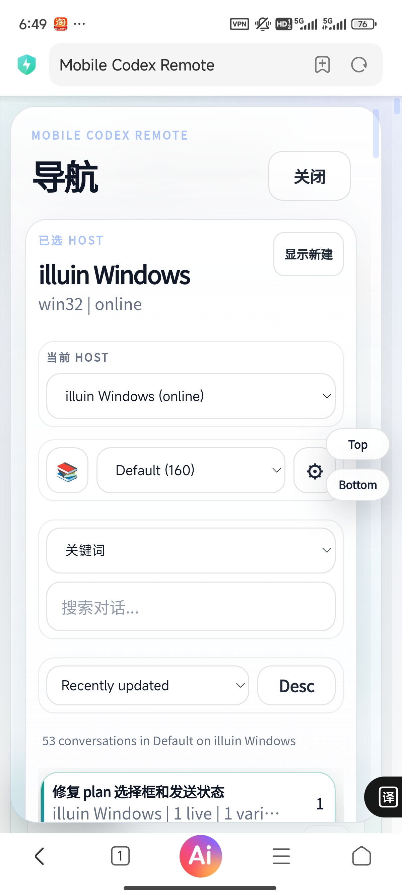
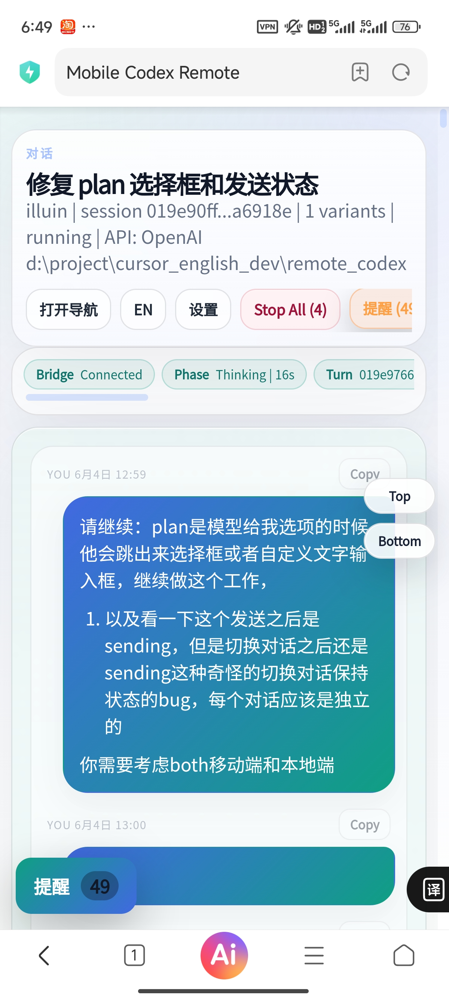
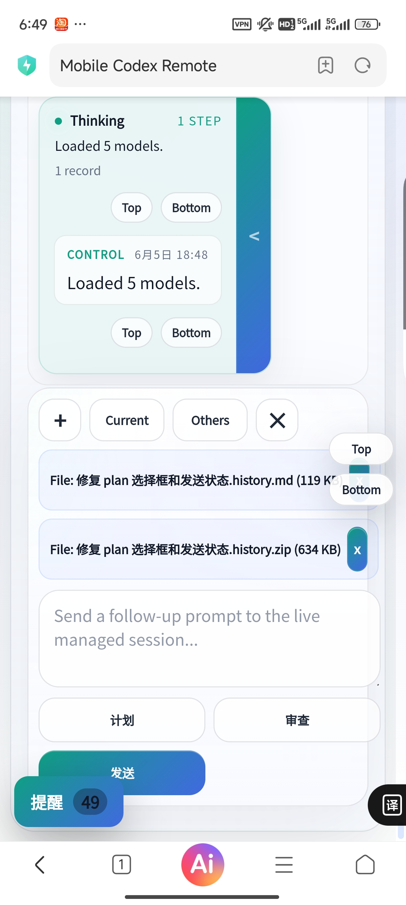

# Remote Codex：手机也能控制 Codex 长任务

把 Codex 变成一个可以在手机、Windows、Linux、远程服务器和 HPC 集群之间接力使用的 AI 工作台。
不用一直守在电脑前：你可以在手机上看进度、接管对话、上传文件、导入历史上下文，并在上下文丢失时一键把当前会话重新附加回 prompt。

> 完整中文手册：[README.zh-CN.md](README.zh-CN.md)
> English guide: [README.en.md](README.en.md)
> 本次更新报告：[docs/update-report-2026-06-05.md](docs/update-report-2026-06-05.md)

## 它解决什么问题？

- Codex 跑长任务时，你不用一直坐在工位电脑前。
- 手机可以直接看 thinking、输出、报错、文件、请求确认和运行状态。
- 图片、本地文本文件、远程生成文件都能进入同一条可见附件链路。
- 对话之间可以互相导入内容：把一个会话的历史、thinking、图片、文件附加到另一个会话继续问。
- 上下文丢失或 compact 后不放心时，可以点 `Current`，一键把当前会话导出并重新附加到输入栏。
- Windows 可以一键启动；远程 Linux/HPC 可以用 host-agent 或 connector 接入。

## 手机效果

<p align="center">
  
  
  
</p>

## Windows 桌面端使用方法

Windows 端和手机端使用同一套网页 UI。双击 `start-windows.bat` 后，在左侧选择本机 host，例如 `ILLUIN Windows`，就可以在桌面浏览器里管理本机、远程 Linux 和 HPC 上的 Codex 会话。

<p align="center">
  
  
</p>
<p align="center">
  
  
  
</p>

- 文件在线可视化、下载和打开：Codex 输出本机或远端文件路径后，页面会显示文件卡片。图片和 SVG 可以 `Preview`，文件可以 `Open` 或 `Save`；已经缓存到 relay 的图片和文本会一起进入 transcript 和 export。
- 自动扫描所有对话并导入：host-agent 会扫描对应 host 的 Codex home，通常是 `%USERPROFILE%\.codex\sessions` 或 `~/.codex/sessions`，把历史会话自动导入左侧列表。`Current` 可以把当前会话重新附加到输入框，`Others` 可以多选其他会话作为上下文。
- API 切换：在 `Settings -> API profiles` 新建 OpenAI 兼容 profile，填写 Base URL 和 API Key，再在 Host API 映射里给 Windows、Linux 或 HPC 分别指定 profile。新建或重启 managed session 后生效，已经运行的 session 会继续使用启动时的 API 环境。
- 对话历史导入导出：`Export` 支持 Markdown、JSON 和 Zip bundle，可以按日期范围、具体日期、thinking/activity、图片、文件扩展名和具体文件筛选。导出的 `.history.md` 和 `.history.zip` 可以继续作为附件放回 composer。
- 跨平台导入导出：Windows、远程 Linux 和 HPC 会话都在同一个 relay 里展示。你可以从一个 host 导出历史和文件，再附加到另一个 host 的会话继续问；Zip 里会保留已缓存的图片和文件，原始路径也会保留便于回到对应机器查找。

## 30 秒启动

### Windows 用户

双击仓库根目录的：

```text
start-windows.bat
```

它会自动：

- 启动 relay；
- 启动本地 host-agent；
- 打开浏览器；
- 默认使用 `http://127.0.0.1:8797`；
- 日志写入 `tmp/windows-start/`。

也可以手动指定端口：

```powershell
.\start-windows.bat -Port 8797
```

### macOS / Linux / 通用 Node 启动

```bash
git clone https://github.com/lanchoxie/remote_codex.git
cd remote_codex
npm run dev
```

然后打开：

```text
http://127.0.0.1:8787
```

当前项目主要使用 Node.js 内置模块，通常不需要 `npm install`。如果未来加入依赖，再执行 `npm install`。

## 适合谁？

- 经常让 Codex 跑长任务、改代码、看日志的人。
- 想用手机盯进度，而不是一直开着电脑的人。
- 有远程 Linux、实验室服务器、学校 HPC 集群的人。
- 经常让 Codex 读图片、实验结果、Markdown、代码文件的人。
- 需要把一个会话的历史和文件导入另一个会话继续分析的人。
- 担心 compact 或上下文丢失，希望能一键恢复当前会话上下文的人。

## 核心功能

### 手机远程控制 Codex

在电脑或服务器上跑 Codex，用手机打开网页就能看：

- 当前 host 和会话；
- Codex thinking / runtime 状态；
- token usage、alerts、requests；
- 输出文件、图片、报错；
- 需要你确认的 approval 或问题选项。

### 对话之间互相导入

这是这一版最重要的能力之一。

- `Current`：把当前会话导出成 history 附件，直接放进 composer。上下文丢了、compact 后不放心、或者想让模型重新参考当前会话时，点一下就能恢复。
- `Others`：选择其他一个或多个会话，把它们的历史附加到当前 prompt。
- 每个会话都可以单独选择是否包含 `Thinking / Images / Files`。
- 小的历史会作为 Markdown 文本附件；包含图片/文件时会额外生成 Zip bundle。

### 文件和图片直接发给 Codex

- 拖拽文件到输入框；
- 粘贴或上传图片；
- 本地文本文件会作为可见附件进入 transcript；
- 远程生成文件会显示成文件卡片，可打开或保存；
- 大文件支持分片上传，但超大数据集仍建议放在 host 文件系统里，让 Codex 读路径。

### Plan mode 和选择框

Plan mode 下，如果模型需要你选择方案或输入自定义内容，页面会弹出表单。
支持选项单选、`Other` 自定义输入、提交状态和移动端适配。

### Windows、本地、远程 Linux、HPC

结构很简单：

```text
浏览器/手机 -> relay -> host-agent -> Codex app-server
```

- Windows 本地：双击 `start-windows.bat`。
- 同局域网 Linux：Linux 上运行 host-agent，连到 Windows relay。
- 学校集群不互通：推荐把 relay 跑在集群上，然后 Windows 用 SSH tunnel 打开网页。
- 有公网/实验室中转机器：relay 跑在中转机器，Windows 和集群都连它。

更详细的远程和 HPC 设置看：[README.zh-CN.md](README.zh-CN.md#添加远程主机或-hpc)。

## 安装要求

- Node.js 22 或更新版本。
- Git。
- Codex CLI。
- Windows 一键启动需要 PowerShell。
- 远程/HPC bootstrap 需要 OpenSSH。

Codex CLI 远程安装示例：

```bash
conda create -n codex-node -c conda-forge nodejs=20 -y
conda activate codex-node
npm install -g @openai/codex
codex --help
```

## 常用命令

```bash
npm run dev            # relay + 本地 host-agent
npm run relay          # 只启动 relay
npm run agent          # 只启动 host-agent
npm run test:managed   # smoke test
```

检查代码：

```bash
node --check apps/relay/server.js
node --check apps/host-agent/agent.js
node --check apps/host-agent/codex-app-server-runner.js
node --check apps/mobile-web/public/app.js
```

## 手机访问

同一局域网下，用电脑的局域网 IP：

```text
http://192.168.1.20:8797
```

跨网络推荐 Tailscale：

```text
http://100.x.y.z:8797
```

不要把 relay 裸露到公网。需要公网使用时，请至少配置私有网络、反代认证或可信访问控制。

## 小红书一句话版

我把 Codex 做成了手机遥控器：Windows 双击启动，手机看进度，图片和文件直接发给 Codex，还能把一个会话的历史导入另一个会话继续问。长任务不用守电脑了。

## 文档入口

- 完整中文使用手册：[README.zh-CN.md](README.zh-CN.md)
- English guide: [README.en.md](README.en.md)
- 更新报告：[docs/update-report-2026-06-05.md](docs/update-report-2026-06-05.md)
- 旧版 v2.01 说明：[README_v2.01.md](README_v2.01.md)
